# 量子计算笔记

## 网站信息

https://oreilly-qc.github.io/

https://pyqpanda-toturial.readthedocs.io/zh/latest/

费米子体系的模拟与计算。https://pychemiq-tutorial.readthedocs.io/en/latest/index.html

量子机器学习计算框架。https://vqnet20-tutorial.readthedocs.io/en/latest/

## 环境搭建

#### qiskit搭建

#### pyQPanda搭建

## 量子计算基础

### 密度矩阵

在经典概率中，实际上我们可以将一个在有限概率空间$\{1, 2, \cdots, n\}$有概率分布$\{p_1, p_2, \cdots, p_n\}$的实值随机变量的观测值（期望）写成如下的三种形式：

1. $E(f)= \sum_j p_j f(j) = \begin{pmatrix} p_1,p_2,\cdots,p_n\end{pmatrix}\begin{pmatrix}f(1)\\f(2)\\ \vdots \\ f(n)\end{pmatrix}$


2. $E(f)= tr{ \begin{pmatrix} p_1 & 0 & 0 & \cdots & 0\\ 0 & p_2 & 0 & \cdots & 0\\ \cdots & \cdots & \cdots & \cdots & \cdots \\ 0 & 0 & 0 & \cdots & p_n \end{pmatrix} \begin{pmatrix} f(1) & 0 & 0 & \cdots & 0\\ 0 & f(2) & 0 & \cdots & 0\\ \cdots & \cdots & \cdots & \cdots & \cdots\\ 0 & 0 & 0 & \cdots & f(n) \end{pmatrix} }$
3. $E(f)=\begin{pmatrix}\sqrt{p_1} e^{-i\theta_1} & \sqrt{p_2} e^{-i\theta_2} & \cdots & \sqrt{p_n} e^{-i\theta_n}\end{pmatrix} \times \begin{pmatrix} f(1) & 0 & 0 & \cdots & 0\\ 0 & f(2) & 0 & \cdots & 0\\ \cdots & \cdots & \cdots & \cdots & \cdots\\ 0 & 0& 0 & \cdots & f(n) \end{pmatrix} \begin{pmatrix} \sqrt{p_1}e^{i\theta_1}\\ \sqrt{p_2}e^{i\theta_2}\\ \vdots \\ \sqrt{p_n} e^{i\theta_n} \end{pmatrix} $

量子密度矩阵就是第二种方式的左边的概率矩阵，当非对角元不是0的推广。

第三种方式是量子态的表达形式。

### 厄密矩阵

如A的共轭转置矩阵等于它本身，则A是厄密矩阵。

### 幺正矩阵

如果矩阵$U$满足$U^\dagger{U}=UU^\dagger=I_n$，那么称矩阵$U$是幺正矩阵，也称作酉矩阵。幺正矩阵的逆矩阵等于其共轭转置矩阵。

在量子计算中，量子电路等价于幺正矩阵。

同样的，量子计算中，量子电路的逆运算等价于该幺正矩阵的逆矩阵，等价于其共轭转置矩阵。

#### 幺正矩阵的性质1：

如果$X$是幺正矩阵，那么$e^{i\theta{X}}=\cos({\theta})I+i\sin(\theta)X$。

证明：

对左式进行泰勒展开：$e^{i\theta{X}}=I+i\theta{X}+\frac{1}{2}(i\theta{X})^2+\cdots$

注意到，$X$是幺正矩阵，因此$X^2=I$。

又注意到，$cos\theta$的泰勒展开式是$1-\frac{1}{2}\theta^2+\cdots$，$sin\theta$的泰勒展开式是$\theta-\frac{1}{6}\theta^3+\cdots$。

原命题得证。

#### 一些幺正矩阵

##### 泡利X门

也称X门或者NOT门。

${ \begin{pmatrix}0 & 1 \\ 1 & 0\end{pmatrix}}$

##### 泡利Y门

也称Y门。

${ \begin{pmatrix}0 & -i \\ i & 0\end{pmatrix}}$

##### 泡利Z门

也称Z门。

${ \begin{pmatrix}1 & 0 \\ 0 & -1\end{pmatrix}}$

##### RX门

$RX(\theta)=e^{\frac{-i\theta{X}}{2}}=\cos({\frac{\theta}{2}})I-i\sin(\frac{\theta}{2})X={ \begin{pmatrix}\cos({\frac{\theta}{2}}) & -i\sin({\frac{\theta}{2}}) \\ -i\sin({\frac{\theta}{2}})  & \cos({\frac{\theta}{2}}) \end{pmatrix}}$

泡利X门是RX门的特殊形式，此时$\theta=\pi$。

##### RY门

$RY(\theta)=e^{\frac{-i\theta{X}}{2}}=\cos({\frac{\theta}{2}})I-i\sin(\frac{\theta}{2})Y={ \begin{pmatrix}e^{-i\theta} & \\ & e^{i\theta} \end{pmatrix}}$

泡利Y门是RY门的特殊形式，此时$\theta=\pi$。

##### RZ门

$RZ(\theta)=e^{\frac{-i\theta{X}}{2}}=\cos({\frac{\theta}{2}})I-i\sin(\frac{\theta}{2})Z={ \begin{pmatrix}\cos({\frac{\theta}{2}}) & -\sin({\frac{\theta}{2}}) \\ \sin({\frac{\theta}{2}})  & \cos({\frac{\theta}{2}}) \end{pmatrix}}$

泡利Z门是RZ门的特殊形式，此时$\theta=\pi$。

###  纯态与混态

在量子力学当中，纯态由一个相同统计系综所构成，而相对于纯态的混态则可以分解两个以上的系综。

纯态S可用狄拉克符号的右括向量表示：$\ket{\psi}$。

纯态与混合态的差别可以通过计算密度矩阵的迹得知。

将密度矩阵的迹归一化，即$tr(p)=1$，计算$tr(p^2)$。如果$tr(p^2)=1$，那么是纯态。


### 布洛赫球

假设qubit 所处的纯态表达为$\ket{\psi} =\alpha\ket{0}+\beta\ket{1}$，其中$\alpha$和$\beta$是复数。

那么通过取消$\ket{0}$的相位和$|\alpha|^2+|\beta|^2=1$的条件可以将$\ket{\psi}$等价表示为$\ket{\psi}=\cos{\frac{\theta}{2}}\ket{0}+e^{i\varphi}\sin{\frac{\theta}{2}}\ket{1}$。

因此，实际上，如图所示，$\ket{\psi}$等价于布洛赫球球面上的一个点。

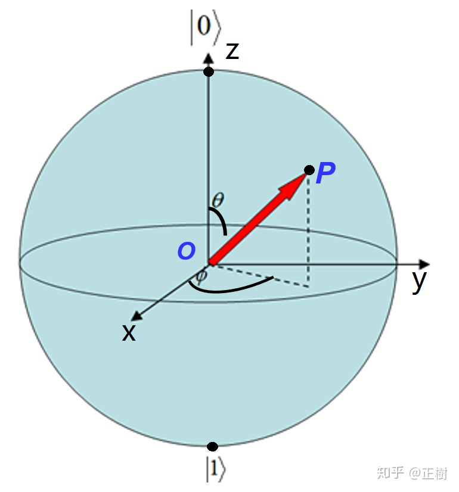

### 多个量子比特

#### 多个量子比特与单个量子比特的关系

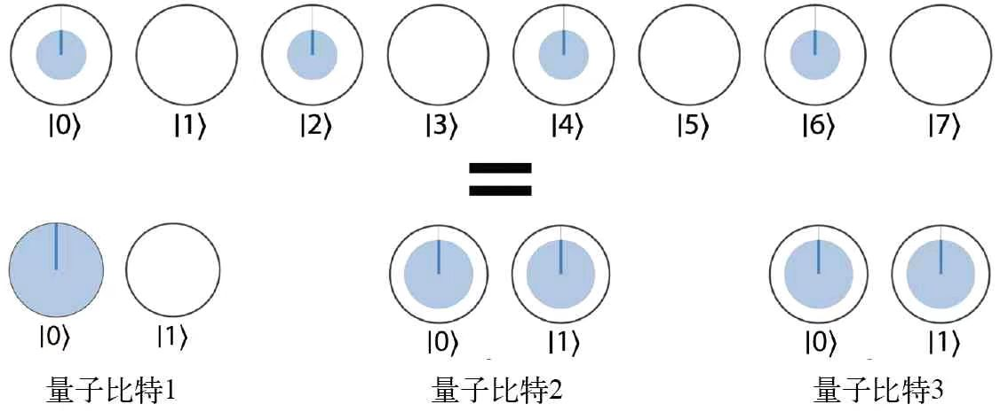

#### 量子纠缠在量子计算中的应用（这些属于个人理解，需要后续的学习验证其正确性）

量子纠缠的本质，就是单个量子的概率分布彼此不独立。

如果独立性成立，那么不妨考虑如下多量子比特的单量子叠加态：

​	假设三个量子比特的共同叠加态为$50\% \ket{0}$和$50\%\ket{7}$，那么会很容易发现，不存在对应的单量子比特状态。这就意味着量子之间具有某种关联，即量子纠缠状态。

因此，实际上，量子纠缠保证了量子比特的指数级信息表达能力。

#### 量子比特的命名

通过16进制进行命名。

#### 多个量子比特计算的算子对

以NOT运算为例，如果对量子比特0x4进行运算，那么每个算子对将包含值的差恰好为4的圆。

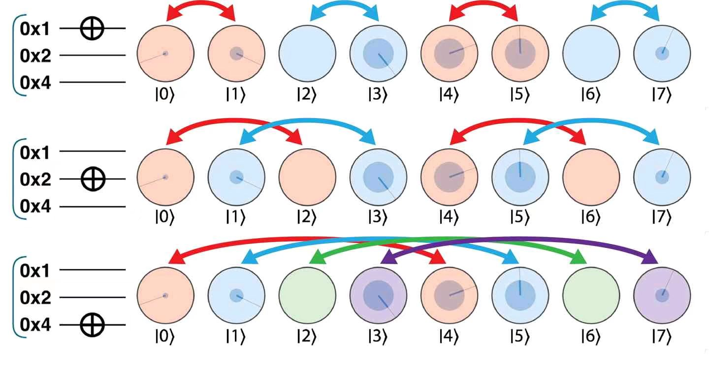

为了更深入地理解其工作原理，需要考虑针对给定量子比特的运算对整个寄存器的二进制表示有何影响。举例来说，上图中的 NOT 运算对第 2 个量子比特进行的圆交换动作相当于简单地翻转每个值的二进制表示的第 2 位。

### 贝尔对与条件量子比特

贝尔对的产生过程如图。

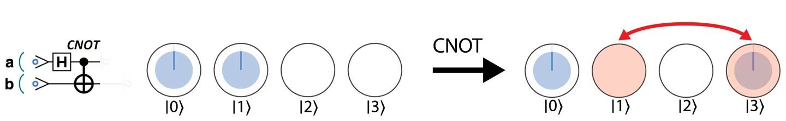

我个人的理解依然是，因为量子纠缠的存在，才使得条件量子比特的操作称为可能。

### 张量积

设$\ket{w}=c_0\ket{a_0}+c_1\ket{a_1}，\ket{v}=d_0\ket{b_0}+d_1\ket{b_1}$。那么称$\ket{w}\otimes\ket{v}$为张量积，简记为$\ket{w}\ket{v}$。

$\ket{w}\ket{v}=c_0d_0\ket{a_0}\ket{b_0}+c_1d_0\ket{a_1}\ket{b_0}+c_0d_1\ket{a_0}\ket{b_1}+c_1d_1\ket{a_1}\ket{b_1}$

### 张量积的二次范数

$||\ket{a}\ket{b}+\ket{c}\ket{d}||_2 = \sqrt{\braket{a}\braket{b} + \braket{c}\braket{d} + 2\braket{a}{c}\braket{b}{d}}$

### 哈密顿量模拟

#### 什么是哈密顿量

哈密顿量是由薛定谔方程所推导出来的。具体推导过程参考：[哈密顿量模拟（Hamiltonian simulation） - 知乎 (zhihu.com)](https://zhuanlan.zhihu.com/p/150292241)

其意义是给出，当量子逻辑门独立于时间的前提下，从初态到末态的波函数的变化过程。

$\ket{\psi(t)}=e^{-iHt}\ket{\psi{0}}$

### 交换测试及其推广

交换测试（SWAP TEST）的电路图如图所示。

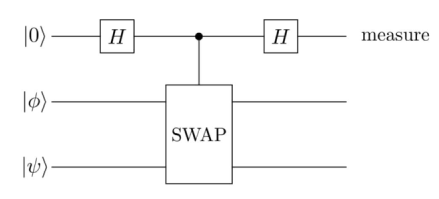

考察该电路的输入：$\ket{0\phi\psi}$。

第一个hadmard门之后：$\frac{1}{\sqrt{2}}(\ket{0\phi\psi}+\ket{1\phi\psi})$。

SWAP门之后：$\frac{1}{\sqrt{2}}(\ket{0\phi\psi}+\ket{1\psi\phi})$。

第二个hadmard门之后：$\frac{1}{2}(\ket{0\phi\psi}+\ket{1\phi\psi}+\ket{0\psi\phi}-\ket{1\psi\phi})=\frac{1}{2}\ket{0}(\ket{\phi\psi}+\ket{\psi\phi})+\frac{1}{2}\ket{1}(\ket{\phi\psi}-\ket{\psi\phi})$。

根据张量积的二次范数定义，$P(\ket{0})=(||\frac{1}{2}(\ket{\phi\psi}+\ket{\psi\phi})||_2)^2=\frac{1}{4}(\langle \phi|\phi \rangle+\langle \psi|\psi\rangle+ \langle \phi|\psi\rangle+\langle \psi|\phi\rangle)=\frac{1}{2}(1+\langle \phi|\psi\rangle)$

所以，如果$\phi=\psi$，那么$P(\ket{0})=1$，$\phi$和$\psi$相似度越高，$P(\ket{0})$越接近于1。

### 量子傅里叶变换（QFT）

QFT是定义在一组标准正交基$\ket{0},\ket{1},\ket{2},\cdots,\ket{N-1}$的线性算子：

$\ket{j}\rightarrow \frac{1}{\sqrt{N}}\sum\limits_{k=0}^{N-1}e^{2\pi{ijk}/N}\ket{k}$。

因此$\sum\limits_{j=0}^{N-1}x_j\ket{j}\rightarrow \sum\limits_{j=0}^{N-1}y_k\ket{k}$。其中，$y_k=\frac{1}{\sqrt{N}}\sum\limits_{j=0}^{N-1}x_je^{2\pi{ijk}/N}$。

#### QFT的电路图


### Shor算法

#### Shor算法的整体思路

Shor算法解决的问题是RSA算法中的大数分解问题，即$N=p_1p_2$的分解问题。

假设存在一个数$a$满足$\gcd(a,N)=1$，且$r$是$a^n\mod{N}$的阶，如果$r$是偶数，那么显然$(a^{\frac{r}{2}}+1)(a^{\frac{r}{2}}-1)\equiv0\mod{N}$。因此$a^{\frac{r}{2}}+1$和$a^{\frac{r}{2}}-1$必然分别是$p_1$和$p_2$的倍数，或者分别是$1$和$N$的倍数。

此时用$p_1=\gcd(a^{\frac{r}{2}}+1,N)$和$p_2\gcd(a^{\frac{r}{2}}-1,N)$就可以进行计算。

接下来的问题演化为，对于任意一个周期函数$f(x)$，能否在多项式时间内，求得其周期。

#### 周期函数的周期求解

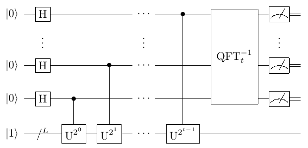

周期函数的周期算法如图。其中$U^j\ket{y}=\ket{yx^j\mod{N}}$。

### Grover迭代的四个应用：振幅放大问题、量子搜索问题、量子计数问题与振幅估计问题

#### 振幅放大问题

假设存在$f$可以将任意量子态$\ket{\psi}$表示成两个正交基的线性组合：$\ket{\psi}=a\ket{\psi_0}+b\ket{\psi_1}$。那么可否通过某个变换$F$使得$F(\ket{\psi})=a^{'}\ket{\psi_0}+b^{'}\ket{\psi_1}$中，$\abs{b^{'}}$接近于1。

#### 量子搜索问题

集合 $\Omega$ 中存在某个集合$B\subseteq{\Omega}$为特定问题的解，其中$ \abs{\Omega}=N=2^n$，$ B\subseteq{\Omega}$，$ \abs{B}=M$。

判别函数$f$的定义如下：

$$
f:\Omega \rightarrow \{0,1\} \\
f(x) =
\begin{cases}
1, x\in{B} \\
0, x\notin{B}
\end{cases}
$$

求一个满足$f(x_0)=1$的解 $x_0$。

#### 量子计数问题

集合 $\Omega$ 中存在某个集合$B\subseteq{\Omega}$为特定问题的解，其中$ \abs{\Omega}=N=2^n$，$ B\subseteq{\Omega}$，$ \abs{B}=M$。

判别函数$f$的定义如下：

$$
f:\Omega \rightarrow \{0,1\} \\
f(x) =
\begin{cases}
1, x\in{B} \\
0, x\notin{B}
\end{cases}
$$

求 $M$。

#### 振幅估计问题

假设有算子$A$有$A\ket{0}=\sqrt{1-a}\ket{\psi_0}+\sqrt{a}\ket{\psi_1}$。请问给出$a$的估计。

#### Grover迭代

Grover迭代的电路如图：

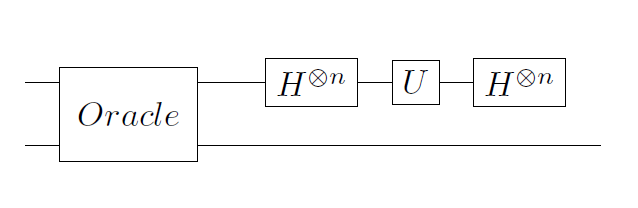

其中，Oracle：$\ket{x}\rightarrow (-1)^{f(x)}\ket{x}$

Oracle本质是利用实际问题中，验证比求解容易这一事实。

U是相位偏移算子，U：$2\ket{0}\langle 0|-I$

可以注意到，Grover迭代电路的第234步合一起的效果为$H^{\otimes{n}}UH^{\otimes{n}}=2\ket{\psi}\langle\psi|-I$

##### Oracle的构造（以下内容纯属个人理解）

例如求解大数分解问题$N=pq$。那么Oracle可以构造如下：

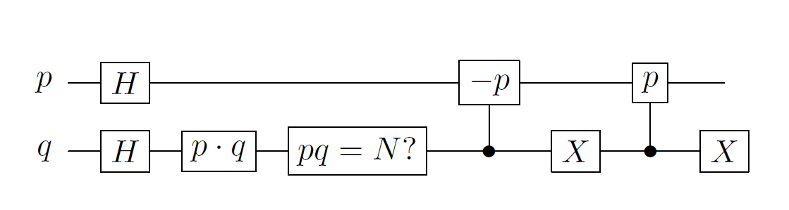

#### Grover迭代的镜面反射解释

记$\sum^{'}_x$为搜索问题中所有解的和，$\sum_x^{''}$为搜索问题中所有非解的和，$\ket{a}=\frac{1}{\sqrt{N-M}}\sum^{'}_x{\ket{x}}$，$\ket{b}=\frac{1}{\sqrt{M}}\sum^{''}_x\ket{x}n$。显然$\ket{a}$和$\ket{b}$是正交的。

那么初态$\ket{\psi}=\frac{\sqrt{N-M}}{\sqrt{N}}\ket{\alpha}+\frac{\sqrt{M}}{\sqrt{N}}\ket{\beta}$。

Oracle实际上就是进行了如下操作：$O(a\ket{\alpha}+b\ket{\beta})=a\ket{\alpha}-b\ket{\beta}$。其集合含义即将$\ket{\psi}$以$\ket{\alpha}$为法线进行反射。Grover迭代的第234步的效果是以$\ket{\psi}$为法线，对$O(\psi)$进行反射。

如果记$\ket{\psi}=\cos{\frac{\theta}{2}}\ket{\alpha}+\sin{\frac{\theta}{2}}\ket{\beta}$，那么k次Grover迭代之后，会变成$\cos{\frac{(2k+1)\theta}{2}}\ket{\alpha}+\sin{\frac{(2k+1)\theta}{2}}\ket{\beta}$。

Grover迭代可以写作${ \begin{pmatrix}\cos{\theta} & -\sin{\theta} \\ \sin{\theta} & \cos{\theta}\end{pmatrix}}$。其中$\sin{\theta}=\frac{2\sqrt{M(N-M)}}{N}$。

#### 振幅放大算法

振幅放大算法的电路如图：

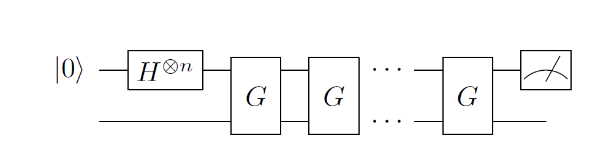

其中G是Grover迭代。

#### 振幅放大算法中Grover迭代的次数

事实上，振幅放大问题中，我们会发现，通过旋转$\arccos{\sqrt{\frac{M}{N}}}$，可以将$\ket{\psi}$旋转到$\ket{\beta}$。因此重复$R=CI(\frac{\arccos{\sqrt{\frac{M}{N}}}}{\theta})$次Grover迭代，可以尽可能的接近$\ket{\beta}$。其中，$CI$是向下取整函数。

#### 量子搜索算法

事实上，量子搜索问题中，我们可以发现，$\sin{\frac{(2k+1)\theta}{2}}$趋近于1，那么就有更大的概率，得到问题的一个解。可以通过对该解进行验证，来进行判断。所得到的解是一个解的概率为$(\sin{\frac{(2k+1)\theta}{2}})^2$。

因此实际上，量子搜索问题就转化为了振幅放大问题。

#### 量子计数算法

事实上，量子计数问题等价于估算$\theta$，这是因为$\sin{\theta}=\frac{2\sqrt{M(N-M)}}{N}$。由于$G$的特征值为$e^{i\theta}$和$e^{i(2\pi-\theta)}$，因此这等价于估算Grover迭代算子$G$的特征值。

估算$G$的特征值可以用相位估计算法进行实现。

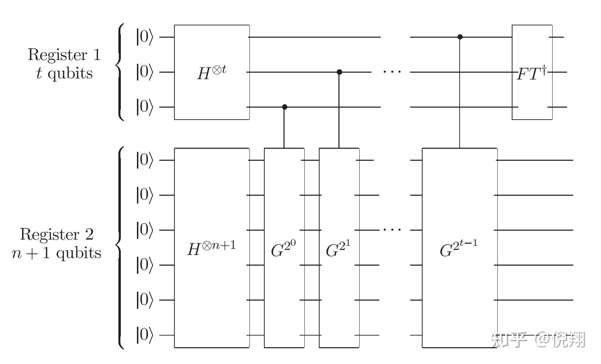

上述电路中，第一个寄存器包含$t=m+\log(2+\frac{1}{\varepsilon})$个比特，第二个寄存器包含$n+1$个寄存器。

最终所获得的

这种算法以$1-\varepsilon$的概率确定$\theta$，精度为$2^{-m}$。

#### 振幅估计算法

事实上，$\sqrt{a}=\sin{\frac{\theta}{2}}$，其中$\theta$就是Grover迭代中的$\theta$。因此实际上，该问题等价于量子计数问题。

### 三角函数门


### 两级酉矩阵分解定理（这个名字是我瞎编的）

（量子计算与量子信息： p160）

任意酉矩阵都可以分解为若干个二级酉矩阵的乘积。

二级酉矩阵，即仅改变向量的两个值的酉变换。

## QPU操作

### QPU指令集

#### NOT

如果$\ket{\psi} =\alpha\ket{0}+\beta\ket{1}$，那么逆运算$\ket{\psi^{'}} =\beta\ket{0}+\alpha\ket{1}$。

##### 可逆性： NOT运算是可逆的。并且NOT的逆运算是它自己。

#### HAD

为某个呈现$\ket{0}$或者$\ket{1}$的量子比特创建相等的叠加态。

即对$\ket{0}$进行HAD操作，得到$\frac{\sqrt{2}}{2}\ket{0}+\frac{\sqrt{2}}{2}\ket{1}$。

即对$\ket{1}$进行HAD操作，得到$\frac{\sqrt{2}}{2}\ket{0}-\frac{\sqrt{2}}{2}\ket{1}$。

为什么会产生相位，这个后面会讲。

如果对已经处于叠加态的量子比特应用HAD运算。那么HAD运算会分别作用于$\ket{0}$和$\ket{1}$，然后相加。

##### 可逆性：HAD运算是可逆的。并且HAD的逆运算是它自己。

#### READ

讲READ指令应用于单个量子比特将返回0或者1。每个结果出现的概率等于振幅的平方。

##### 可逆性：READ运算是不可逆的。

#### WRITE

通过READ指令和NOT指令，即先进行READ指令，所得值如果与计划写入的值不同，则应用NOT指令。因此WRITE指令只能写入$\ket{0}$态或者$\ket{1}$态。

##### 可逆性：与READ一样，WRITE是不可逆的。

#### PHASE($\theta$)

PHASE操作就是按照$\theta$给$\ket{1}$添加相应的相位。

注意，PHASE操作不会给$\ket{0}$添加相位。

##### 可逆性：可逆，逆操作：PHASE($-\theta$)

#### RNOT

即ROOT-of-NOT。执行两次等于一次NOT操作。

构建RNOT指令的方式不止一种，如HAD+PHASE($90\degree$)+HAD就是一种。

证明很简单：NOT=HAD+PHASE($180\degree$)+HAD=HAD+PHASE($90\degree$)+PHASE($90\degree$)+HAD=HAD+PHASE($90\degree$)+HAD+HAD+PHASE($90\degree$)+HAD = RNOT+RNOT

##### 可逆性：显然，RNOT也是可逆的，它的逆操作等于连续三次的RNOT操作。

#### CNOT

CNOT操作是这样的：对两个量子比特进行操作，当且条件量子比特的值是1的时候，针对目标量子比特应用NOT运算。如图所示。

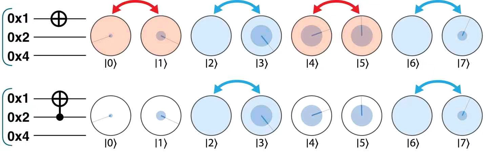

#### CPHASE($\theta$)和CZ

在条件量子比特的值为$\ket{1}$的时候，对目标量子比特执行旋转操作。

值得注意的是，这会导致这两个量子比特的$\ket{1}$都旋转$\theta$。

对CPHASE操作来说，不用关心哪个是条件比特，哪个是目标比特。

CZ即CPHASE($180\degree$)。

CPHASE($\theta$)的电路图如图。


CZ的电路图如图。

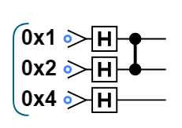

#### CCNOT

可以理解为同时满足多个条件的CNOT。

#### SWAP和CSWAP

如图所示，SWAP有两种电路表示方法。并且等价于三个CNOT运算。

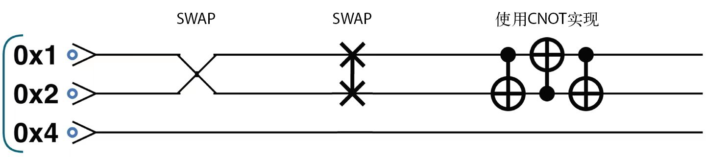

CSWAP如图所示。

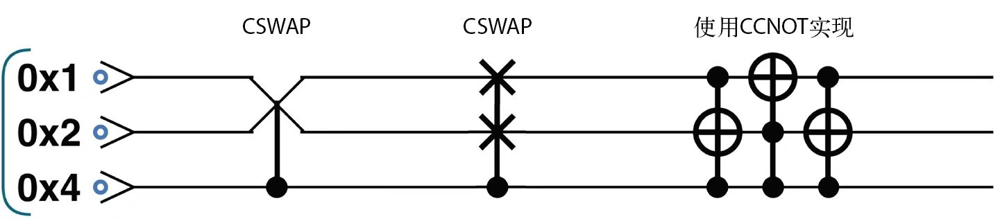

#### Grover迭代

### QPU等效操作

#### HAD + PHASE($180\degree$)+ HAD =NOT

#### HAD + NOT + HAD = PHASE($180\degree$)

#### RNOT + RNOT =NOT

#### HAD+CNOT+HAD=CZ

#### CNOT+CNOT+CNOT=SWAP

##### 证明：

假设两个比特分别为$\ket{a}$和$\ket{b}$。

那么，他们的初始状态是：$q_1=\ket{a}$，$q_2=\ket{b}$。

第一次CNOT之后，$q_1=q_1\oplus{q_2}=\ket{a}\oplus\ket{b}$，$q_2=\ket{b}$。

第二次CNOT之后，$q_1=\ket{a}\oplus\ket{b}，q_2=q_2\oplus{q_1}=\ket{a}$。

第二次CNOT之后，$q_1=q_1\oplus{q_2}=\ket{b}，q_2=\ket{a}$。

#### CCNOT+CCNOT+CCNOT=CSWAP

## QCEngine语言

| QCEngine函数 | 使用方法                | 方法说明                                                     | 示例 |
| ------------ | ----------------------- | ------------------------------------------------------------ | ---- |
| read         | qint.new([num],[label]) | 创建一个qint对象，将num个量子比特分配给这个qint对象，并赋予这个qint对象label这个标签。在后续的操作中，我们可以直接操作这个qint对象所代表的量子比特组。 |      |
| reset           | qc.reset([num])                            | 分配num个量子比特，并初始化                                  | qc.reset(4)                                 |
| write           | qc.write([value])                          | 对所有已经初始化的量子比特，按照value的二进制表达，写入相应的值。（可以应用在qint上） | qc.write(2)                                 |
| write           | qc.write([value]，[qubit])                 | 对已经初始化的量子比特，按照value的二进制表达，按照qubit所对应的量子比特，写入相应的值。（可以应用在qint上） | qc.write(3,0x3)                             |
| had 或 hadamard | qc.had() 或 qc.hadamard()                  | 对所有已经初始化的量子比特进行HAD操作。（可以应用在qint上）  | qc.had()                                    |
| had 或 hadamard | qc.had([qubit]) 或 qc.hadamard([qubit])    | 对所有已经初始化的量子比特，按照qubit所对应的量子比特，进行HAD操作。（可以应用在qint上） | qc.had(0x2)                                 |
| phase           | qc.phase([angle], [qubit])                 | 对qubit所对应的量子比特执行PHASE(angle)。（可以应用在qint上） | qc.phase(45, 0x4)                           |
| phase           | qc.phase([angle], [con_qubit],[tar_qubit]) | 对qubit所对应的条件量子比特和目标量子比特执行CPHASE(angle)。（可以应用在qint上） | qc.phase(45, 0x4，0x1)                      |
|                 | qc.cnot([target],[condition])              | 如果condition比特的值是1，那么对target比特进行NOT运算。      |                                             |
| exchange | qc.exchange([qubits]) | 对qubit所对应的量子比特进行SWAP运算。（可以应用在qint上） | qc.exchange(0x2\|0x4)  qc.exchange(6) qc.exchange(0b0110) |
| swap | qc.swap([qubits]) | 对qubit所对应的量子比特进行SWAP运算。（可以应用在qint上） | qc.swap(0x2|0x4) |
| swap | swap([tar_qubits], [con_qubit]) | 根据con_qubit对tar_qubit进行CSWAP运算。（可以应用在qint上） | qc.swap(0x2 |
| add             | qint.add([value])                          | 计算qint+=value，value可以是一个确定的数，也可以是一个qint对象 | qint1.add(5) qint1.add(qint2)               |
| subtract        | qint.subtract([value])                     | 计算qint-=value，value可以是一个确定的数，也可以是一个qint对象 | qint1.subtract(5) qint1.subtract(qint2)     |
| addSquared      | qint.addSquared([value])                   | 计算qint+=value\*value，value可以是一个确定的数，也可以是一个qint对象 | qint1.addSquared(5) qint1.addSquared(qint2) |


## pyQPanda语言

| 操作                       | 方法                                            | 方法说明 | 示例                                                         |
| -------------------------- | ----------------------------------------------- | -------- | ------------------------------------------------------------ |
| 初始化                     | CPUQVM()<br>init_qvm()                          |          | qvm = CPUQVM()<br>    qvm.init_qvm()                         |
| 在量子计算机上分配空间     | qAlloc_many()                                   |          | qubits = qvm.qAlloc_many(3)                                  |
| 在CPU上分配空间            | cAlloc_many()                                   |          | cbits = qvm.cAlloc_many(1)                                   |
| 单次运行                   | directly_run()                                  |          | result = qvm.directly_run(prog)                              |
| 多次运行                   | run_with_configuration                          |          | result = qvm.run_with_configuration(prog, c, 100)            |
| 概率测量                   | prob_run_list prob_run_tuple_list prob_run_dict |          | result = prob_run_dict(prog, qubits, 3)                      |
| read操作                   | Measure(q[0], c[0])                             |          | prog.insert(Measure(q[0], c[0]))                             |
| write操作                  | prog.insert(X(q[1]))                            |          | 刚刚初始化和分配空间的量子比特，其值默认为0。可以通过X门将之赋值为1。 |
| 共轭                       | dagger()                                        |          | rx_dagger = RX(qubits[0], np.pi).dagger()                    |
| 将prog逆读取为一系列逻辑门 | convert_qprog_to_originir()                     |          | convert_qprog_to_originir(prog, machine)                     |

#### QCircuit类

1. QCircuit是逻辑门的数据类型
2. 创建QCircuit对象

```python
cir = QCircuit()
```

3. <<符号：QCircuit对该操作符实现了重载

#### QProg类

#### 变量

我们可以通过传入一个浮点型的数据来构造一个标量变量，也可以通过传入numpy库生成的多维数组来构造一个矢量或矩阵变量。

1. 创建一个标量：
   v1 = var(1)

2. 创建一个向量：
   a = np.array([[1.],[2.],[3.],[4.]])
   v2 = var(a)
   
3. 创建一个矩阵：
   b = np.array([[1.,2.],[3.,4.]])
   v3 = var(b)
   

我们可以在不改变表达式结构的情况下，通过 set_value 接口改变某个变量的值，即可得到不同的计算结果。我们可以调用 eval 接口，来计算该变量当前的值。

v1 = var(1)
v2 = var(2)

add = v1 + v2
print(eval(add)) # 输出为[[3.]]

v1.set_value([[3.]])
print(eval(add)) # 输出为[[5.]]

#### 可变量子逻辑门

在普通的量子门中，参数是固定的值，如CNOT门中的参数，是常量。

可变量子门中，第二个参数是var变量。

## 量子算术与逻辑

### 加法和减法

#### 自增1和自减1

自增1和自减1的计算逻辑如下：

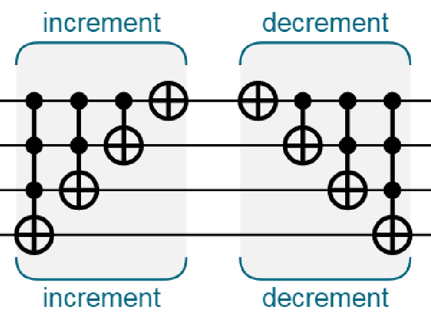

**我的看法：在传统计算中，从最低位开始计算，那么如果进位，实际上需要额外的寄存器来存储结果，而如果有了额外的存储器存储结果，实际上就得到了a+b的副本，和不可复制性是矛盾的**

#### 自增10和自减10

自增10和自减10的计算逻辑如下：

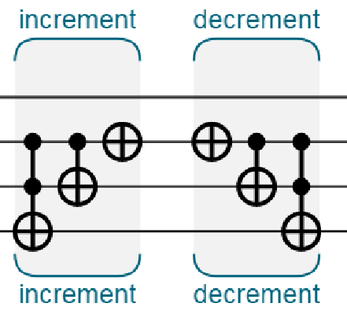


其他计算增减0x4、0x8、0x10的计算以此类推。

#### 其他增加一个固定数值

可将该数值分解为上述的整数，然后依次计算。

#### 两个处于叠加态的量子整数相加

首先要说明的是，在传统计算中，计算a+b的时候，我们一般是选择第三个寄存器，将a+b的结果存在该寄存器中。但量子计算中，这是不可行的，因为这实际上在第三个寄存器中创建了一个a或者b的副本。与量子计算中的不可复制性是矛盾的。

因此实际上，在量子计算中，我们说计算a+b的时候，实际上是在进行自增运算，即a+=b的运算。

a+=b的运算如下：

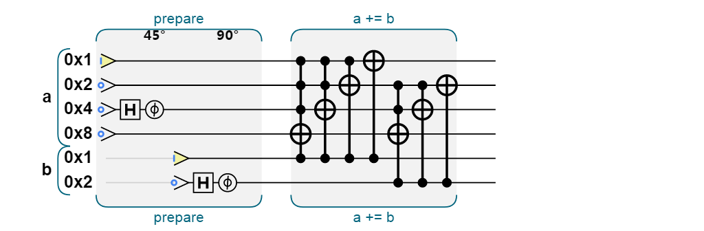

其本质就是检测b的各位是否是1，如果在某一位是1，则对a进行相应的自增计算。

### 负整数

与传统计算一样，整数取反即翻转所有位并加1。

如图所示。

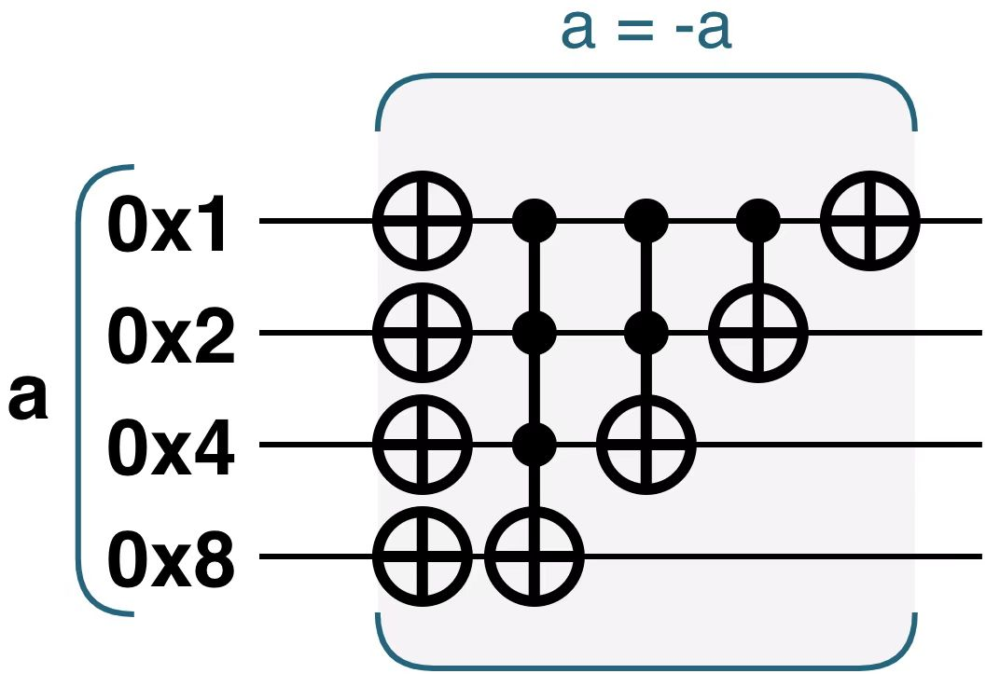

### 乘法

在量子计算中，乘法很难以可逆的方式执行。因此，将b的平方加到a上，是一种更加合理的计算方式。

乘法计算如图。

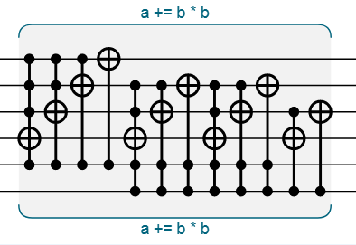

其本质即$a+=b^2=b_0^2+2b_0b_1+b_1^2$，以b为条件，去对a进行自增运算。

可以知道实现逆运算是容易的。即实现$a-=b^2$。

### 绝对值

在量子计算中，可逆性是很重要的。绝对值计算是不可逆的，因为没有记录有关于符号位的信息。

因此，需要引入临时量子比特来辅助进行绝对值的计算，从而实现可逆性。

计算abs（a）的方式如图。

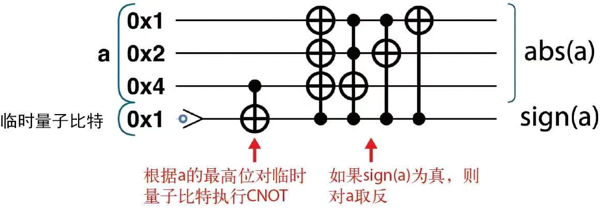


## 振幅放大

### 翻转-镜像例程

翻转+Grover迭代。

### AA迭代

将相位差转化为强度差。（详见6.2）

### 从弹弓思维看待AA迭代

1. 计算平均值
2. 根据平均值翻转

### 相位估计

### 振幅编码

## QFT

量子傅里叶变换如图：


## qiskit学习

## 量子物理的基本

### 张量网络 tensor network

